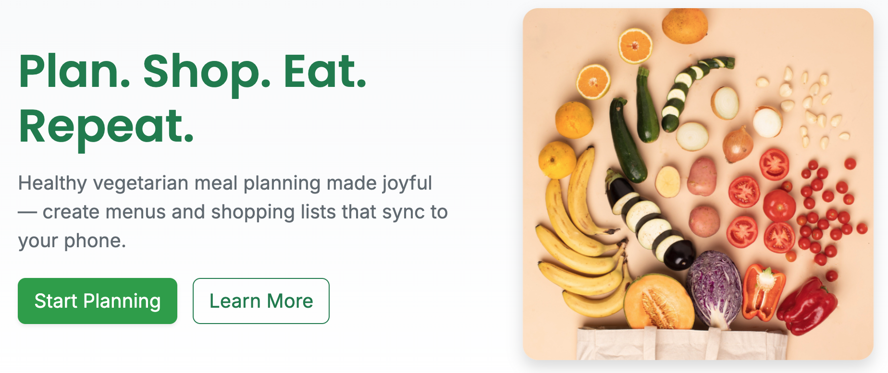

# 🥕 Plantastic



### Plan. Shop. Eat. Repeat.

**Plantastic** is a full-stack web application designed to make vegetarian meal planning simple, enjoyable, and efficient.  
Users can explore a variety of vegetarian recipes, create meal plans, manage ingredients, and export shopping lists directly to their phones.

The main goal is to provide a **light, intuitive, and visually appealing** user experience for everyday cooking and shopping.

**Deployed Links:**

- **Client:** [https://plantastic-gold.vercel.app/](https://plantastic-gold.vercel.app/)
- **Server:** [https://plantastic-server.onrender.com/API/](https://plantastic-server.onrender.com/API/)

## 🧰 Built With

- **Frontend:** React, Vite, Bootstrap
- **Backend:** Node.js, Express
- **Database:** MongoDB (via Mongoose)
- **Hosting:** Frontend → Vercel, Backend → Render
- **Cloud Storage:** Cloudinary (for recipe image uploads)

---

## User Stories

- **Browse Recipes:** As a visitor, I can explore vegetarian recipes without needing to sign up or log in.
- **Sign Up:** As a new user, I can create an account to start saving and managing my own recipes and meal plans.
- **Log In:** As a registered user, I can log in to access and manage my personal recipes and meal plans.
- **Log Out:** As a user, I can log out of my account to ensure my data remains private and secure.
- **Create a Recipe:** As a user, I can create a new recipe and upload my own image from my computer.
- **Update a Recipe:** As a user, I can edit an existing recipe, including changing its details or image.
- **Delete a Recipe:** As a user, I can delete any recipe I’ve created.
- **Create a Meal Plan:** As a user, I can build a custom meal plan by adding or removing recipes.
- **View a Meal Plan:** As a user, I can view my complete meal plan and see all included recipes.
- **Generate a Shopping List:** As a user, I can automatically compile ingredients from my selected recipes into a total shopping list.
- **Edit Shopping List:** As a user, I can edit or remove items from my shopping list directly from my profile dashboard.
- **Export Shopping List:** As a user, I can export my final shopping list to native applications like Notes on Mac — making it easily accessible on my iPhone.

---

## Backlog

- **Custom 404 Page:** Design and implement a friendly “Page Not Found” screen with navigation back to the main site.
- **User Permissions:** Restrict users from editing or deleting recipes that they do not own.
- **Shopping List Sync:** Fix the issue where items are automatically removed from the shopping list unintentionally.

---

# Client / Frontend

---

## React Router Routes (React App)

---

| **Path**                  | **Component**    | **Permissions**           | **Behavior**                                                                                  |
| ------------------------- | ---------------- | ------------------------- | --------------------------------------------------------------------------------------------- |
| `/`                       | HomePage         | Public                    | Displays the hero section, intro text, and buttons to start planning or learn more.           |
| `/recipes`                | RecipesPage      | Public                    | Shows all vegetarian recipes, accessible without login.                                       |
| `/recipes/:recipeId`      | RecipePage       | Public                    | Displays detailed recipe information, including image, ingredients, and instructions.         |
| `/about`                  | AboutPage        | Public                    | Provides project details and author information.                                              |
| `/login`                  | LoginPage        | Public                    | Allows existing users to log in.                                                              |
| `/signup`                 | SignupPage       | Public                    | Allows new users to create an account.                                                        |
| `/recipes/new`            | CreateRecipePage | Private (Logged-in users) | Allows users to create a new recipe with an image upload.                                     |
| `/recipes/:recipeId/edit` | EditRecipePage   | Private (Owner only)      | Enables users to edit or delete their own recipes.                                            |
| `/profile`                | ProfilePage      | Private (Logged-in users) | Displays the user’s dashboard with meal plans and shopping list.                              |
| `/plan/:planId`           | PlanPage         | Private (Logged-in users) | Shows a detailed view of a specific meal plan, including total ingredients and shopping list. |
| `/plan/new`               | CreatePlanPage   | Private (Logged-in users) | Allows users to create a new meal plan by selecting or removing recipes.                      |

---

## Components

#### Page Components

- HomePage
- RecipesPage
- RecipePage
- AboutPage
- LoginPage
- SignupPage
- CreateRecipePage
- EditRecipePage
- ProfilePage
- PlanPage
- CreatePlanPage

#### UI & Utility Components

- Navbar
- Ingredient
- CookingInstructions
- CarrotSpinner
- EmblaCarousel
- EmbleCarouselArrowButtons
- RouteProtector
- isPrivate
- PlantasticOutlet

---

## Services

- Auth Service

  - auth.signup(user)
  - auth.login(user)
  - auth.logout()
  - auth.me()

- Recipe

  - recipe.getAll()
  - recipe.getOne(id)
  - recipe.create(recipe)
  - recipe.update(id, updatedRecipe)
  - recipe.delete(id)

- Plan

  - plan.getAll(userId)
  - plan.getOne(id)
  - plan.create(plan)

- TotalIngredients

  - totalIngredients.getAll(planId)
  - totalIngredients.addItem(item)
  - totalIngredient.updateItem(itemId, updatedItem)
  - totalIngredient.removeItem(itemId)

- Shopping List

  - shoppingList.getOne(id)
  - shoppingList.addItem(item)
  - shoppingList.updateItem(itemId, updatedItem)
  - shoppingList.removeItem(itemId)
  - shoppingList.clearAll()
  - shoppingList.save()
  - shoppingList.export()

# Server / Backend

## Models

### User model

```javascript
{
  name: { type: String, required: true, },
  email: { type: String, required: [true, "Email is required."], unique: true, lowercase: true, trim: true, },
  password: { type: String, required: [true, "Password is required."], },
}
```

### Recipe model

```javascript
{
  name: { type: String, unique: true, trim: true },
  image: { type: String, default: "https://res.cloudinary.com/dojvyjghs/image/upload/v1761742983/tpuinv87s0iy9oa9vtbn.png", },
  duration: { type: Number, min: 0 },
  ingredients: [String],
  instructions: String,
}
```

### Plan model

```javascript
{
  name: { type: String, required: true },
  userId: { type: Schema.Types.ObjectId, ref: "User", required: true },
  recipes: [{ type: Schema.Types.ObjectId, ref: "Recipe" }],
  totalIngredients: [String],
}
```

### ShoppingList model

```javascript
{
  userId: { type: Schema.Types.ObjectId, ref: "User", required: true },
  items: { type: [String], default: [] },
  isTotal: { type: Boolean, default: false },
  planId: { type: Schema.Types.ObjectId, ref: "Plan" },
}
```

---

## API Endpoints (backend routes)

| HTTP Method | URL                             | Request Body                                                | Success status | Error Status  | Description                                                                                          |
| ----------- | ------------------------------- | ----------------------------------------------------------- | -------------- | ------------- | ---------------------------------------------------------------------------------------------------- |
| POST        | /auth/signup                    | { email, password, name }                                   | 201            | 400, 500      | Checks if data entered correctly, ckecks if user already exists, creates new user in database        |
| POST        | /auth/login                     | { email, password }                                         | 200            | 400, 401, 500 | Ckecks if data provided, checks if user doesn't exist in database, creates token if everything is ok |
| GET         | /auth/verify                    |                                                             | 200            | 401           | Checks if user is logged in (has a valid token)                                                      |
| GET         | /api/recipes                    |                                                             | 200            | 500           | Gets all recipes                                                                                     |
| GET         | /api/recipes/:id                | { id }                                                      | 200            | 500           | Gets one recipe                                                                                      |
| POST        | /api/recipes                    | { name, image, ingredients, instructions}                   | 201            | 500           | Creates a new recipe                                                                                 |
| PUT         | /api/recipes/:id                | {id, name, image, ingredients, instructions}                | 200            | 500           | Updates a recipe                                                                                     |
| DELETE      | /api/recipes/:id                | { id }                                                      | 200            | 500           | Deletes a recipe                                                                                     |
| GET         | /api/plans/user/:userId         | { userId }                                                  | 200            | 500           | Gets all the users's plans                                                                           |
| GET         | /api/plans/:id                  | { id }                                                      | 200            | 500           | Gets all the plan's info                                                                             |
| POST        | /api/plans                      | { name, userId, recipes, totalIngredients, shoppingListId } | 201            | 500           | Creates a new plan                                                                                   |
| PUT         | /api/plans/:id                  | { name, userId, recipes, totalIngredients, shoppingListId } | 200            | 500           | Updates the plan                                                                                     |
| DELETE      | /api/plans/:id                  |                                                             | 200            | 500           | Deletes the plan                                                                                     |
| GET         | /api/shopping-list/user/:userId | { userId }                                                  | 200            | 500           | Gets a users' total shopping list (the one on dashboard)                                             |
| GET         | /api/shopping-list/plan/:planId | { planId }                                                  | 200            | 500           | Gets a shopping list, connected to specific plan                                                     |
| PATCH       | /api/shopping-list/:id          | { id, items }                                               | 200            | 500           | Updates items in shopping list                                                                       |

---

## 👩‍💻 Author

### Vera Fileyeva

[GitHub](https://github.com/VeraV) | [LinkedIn](https://www.linkedin.com/in/vera-veramei-5757b257/)
